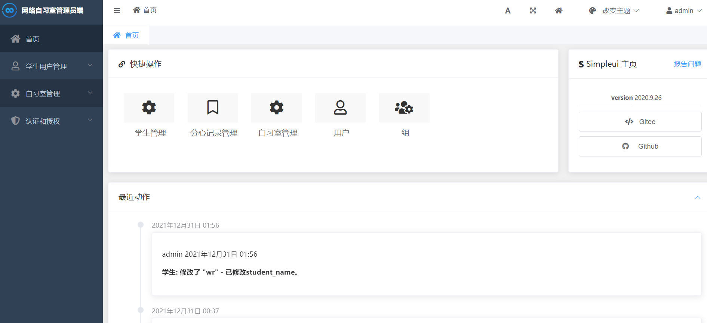
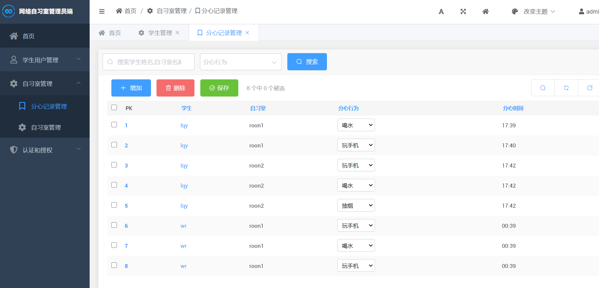
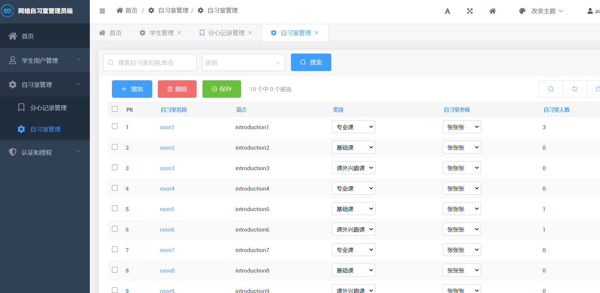
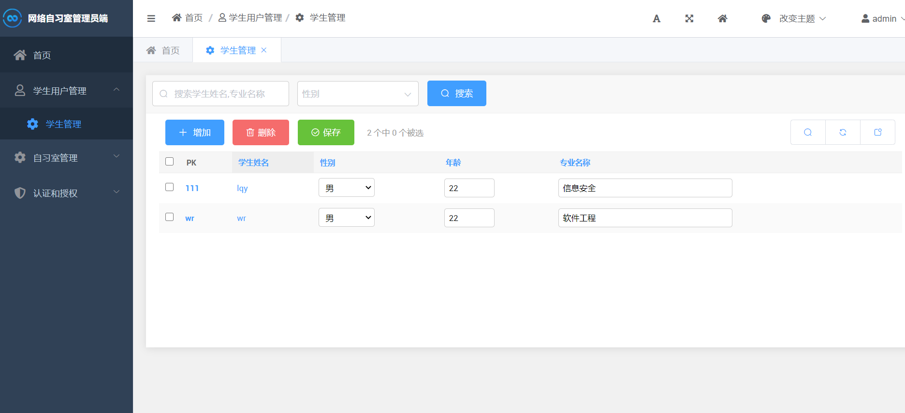
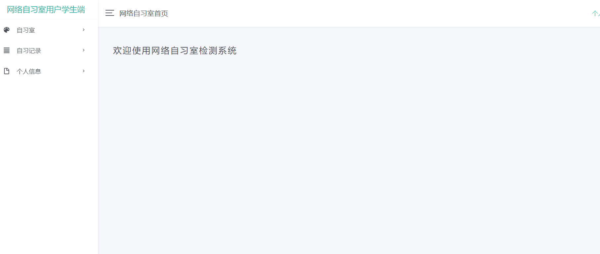
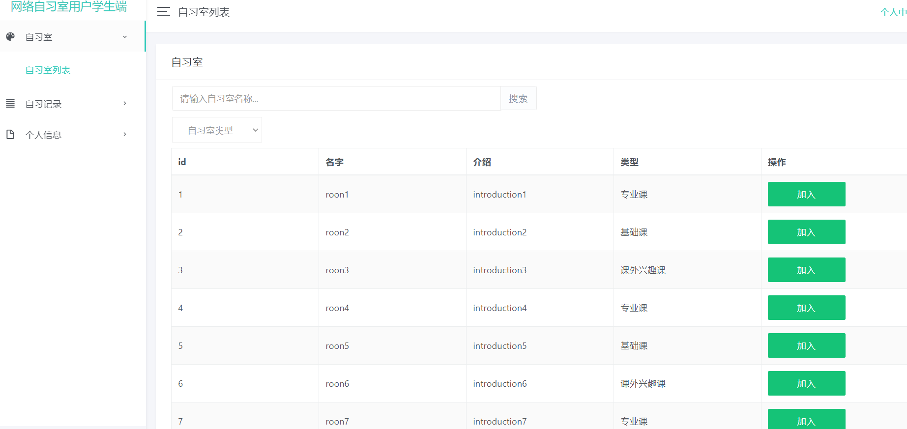
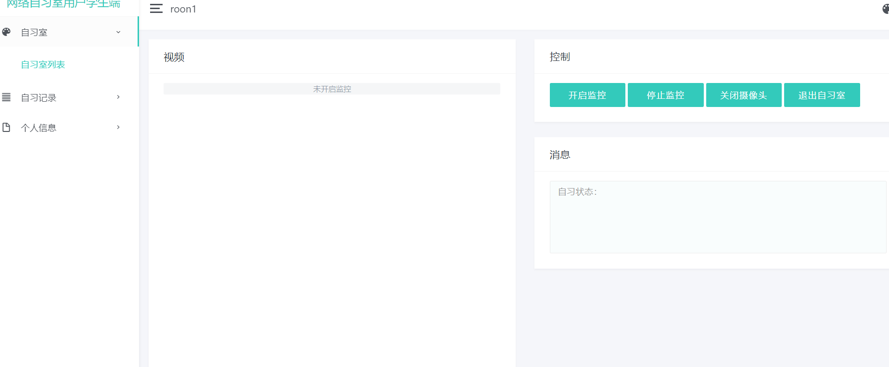
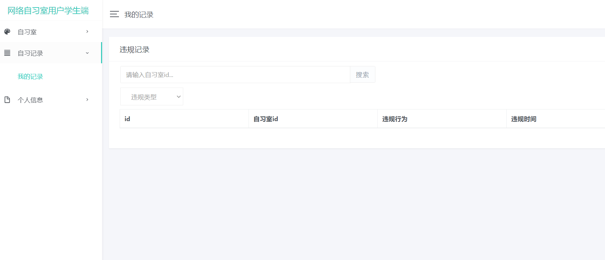

# 学生自习室监控管理系统

包含学生端+管理端两个web项目，浏览器端支持摄像头检测学生行为并记录(包括抽烟、玩手机等)，管理员端进行相应操作


## 界面展示

### 一、老师管理端


​    


​    

​    


    

###     二、学生用户端

9
​    

10
    
11
    

## :hammer: 安装

1. 通过源代码安装

    ```shell
    git clone ......
    python -m pip install -r requirements.txt
    ```


## :blue_book: ​使用

1. 使用命令行 cd 到项目根目录

2. 执行以下命令

    ```shell
    # 创建超级用户（管理员）
    python manage.py createsuperuser
    # 依据模型迁移构建数据库表
    python manage.py makemigrations
    python manage.py migrate
    ```

3. 使用 runserver 命令开启服务器

    ```shell
    python manage.py runserver 0.0.0.0:8000
    ```

4. 在本地浏览器访问 http://localhost:8000/admin/ 看到管理系统，登陆用户名及密码即为刚才创建的超级用户的用户名与密码

5.在本地浏览器访问 http://localhost:8000/userStudent/ 登录学生用户
